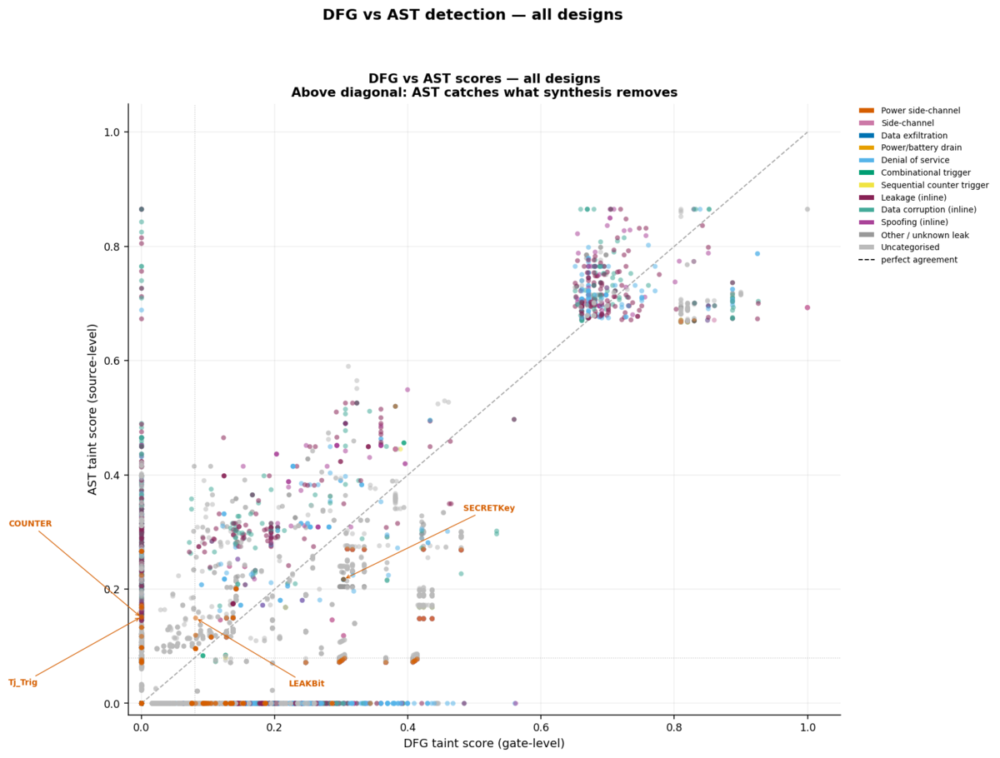
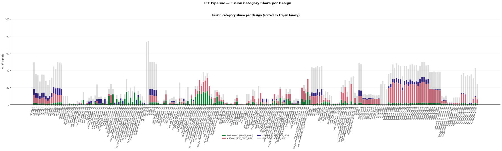

# DRIFT

**A Dual-Representation RTL Information Flow Tracker for Hardware Trojan and Side-Channel Detection**

DRIFT is a static analysis pipeline that scores every signal in a piece of
Verilog RTL for how strongly it is connected to a secret (a key, state
register, or other sensitive input) using **Information Flow Tracking
(IFT)**. It runs two independent, orthogonal analyses over the same design —
one on the **synthesized gate-level netlist** (DFG) and one on the **raw
Verilog AST** (source-level) — and fuses their results into quantitative
labels suitable for training a GNN-based hardware Trojan / side-channel
detector.

The two-path design exists because synthesis tools remove logic they judge
"dead" — which is exactly how some power-side-channel Trojans hide (they
have no digital output, only a power signature). The gate-level path is
blind to that; the source-level AST path catches it. Neither path alone is
sufficient — see [`docs/GUIDE.md`](docs/GUIDE.md) for the worked example.

## Sample output

Illustrative figures from a run of the full pipeline against a private
Trust-Hub-style benchmark corpus (this repo ships without sample designs —
see [Bringing your own designs](#bringing-your-own-designs) — so these exact
plots aren't reproducible out of the box, but they show the shape of what
`--compare` generates):

<p align="center">
  
  <br>
  <em>DFG vs. AST detection across all designs. Points above the diagonal are
  signals the AST (source-level) path catches that the DFG (gate-level) path
  misses because Yosys treated them as dead code — the power-side-channel
  detection case this pipeline exists for.</em>
</p>

<p align="center">
  
  <br>
  <em>Stage 5 fusion category breakdown per design — how much of each design's
  signal set both paths agree is suspicious (green), only AST flags (red),
  only DFG flags (navy), or both call clean (grey).</em>
</p>

## What it produces

For each design, DRIFT emits `outputs/<DESIGN>/`:

- `combined_labels.json` — the main output: one fused entry per signal, with
  DFG score, AST score, combined score, and a category
  (`AGREE_HIGH`, `AST_ONLY_HIGH`, `DFG_ONLY_HIGH`, `DIVERGE`, ...).
- `fusion_report.txt` — a plain-text, human-readable summary of the same.
- `hw2vec/{node_features,edge_index,labels}.npy` — a 14-dimensional
  per-node feature export ready to load into PyTorch Geometric.

Full field-by-field documentation of every output file is in
[`docs/GUIDE.md`](docs/GUIDE.md).

## Pipeline overview

```
RTL Verilog
    │
    ├─ Stage 1: Yosys synthesis ─────────────────────  netlist.json
    ├─ Stage 2: PyVerilog AST extraction ────────────  ast_nodes.csv, ast_taint_scores.json
    ├─ Stage 3: DFG taint propagation (BFS) ─────────  taint_scores.json, dfg_nodes.csv
    ├─ Stage 4: Scoring (golden-delta, GLRA, QtFlow) ─  {golden,glra_dfg,qtflow_dfg,qtflow_ast}_scores.json
    ├─ Stage 5: Label fusion ────────────────────────  combined_labels.json   ← main output
    └─ Stage 6: GNN export + optional training ──────  hw2vec/*.npy, stage6_train/
```

## Quick start

```bash
git clone <this-repo-url>
cd DRIFT
pip install -r requirements.txt
# Install Yosys — see INSTALL.md for your OS. Then:

python3 run_pipeline.py --check-sources   # fast sanity check, no synthesis
python3 run_pipeline.py --design <your-design-name>
```

Full, OS-by-OS installation instructions (Windows, macOS, Linux) are in
[`INSTALL.md`](INSTALL.md).

## Bringing your own designs

DRIFT auto-discovers designs from `stage0_designs/`:

```
stage0_designs/
├── TjIn/<DESIGN_NAME>/*.v     # trojan-inserted (or just plain) Verilog sources
└── TjFree/<DESIGN_NAME>/*.v   # optional clean baseline, same module
```

Drop your `.v` files into `stage0_designs/TjIn/<DESIGN_NAME>/` and the design
becomes available to `--design <DESIGN_NAME>` and `--all`. Source/sink
auto-detection heuristics (what counts as a "secret" input) can be
overridden per design in `config/designs.json` — see
[`stage0_designs/README.md`](stage0_designs/README.md) and
[`docs/GUIDE.md`](docs/GUIDE.md#debugging-checklist) if a design shows "no
sources configured".

This repository ships without any sample designs. Trust-Hub
(<https://trust-hub.org>) is a good source of trojan-inserted RTL benchmarks
if you want a corpus to start from — check that project's own terms before
redistributing its designs.

## Repository layout

```
run_pipeline.py       Orchestrator — entry point for everything above
config/               Design auto-discovery, per-design overrides, scoring weights
stage1_extract/       Yosys synthesis + PyVerilog AST extraction
stage2_ift/           DFG taint propagation (BFS over the netlist)
stage3_scoring/       golden_delta, glra_dfg, qtflow_dfg, qtflow_ast scorers
stage4_fusion/        Label fusion (combined_labels.json)
stage5_export/        hw2vec GNN export
stage6_train/         Optional: PyTorch Geometric node classifier (GraphSAGE/GCN)
visualize/            Figure generation (comparison plots, GLRA bars, QtFlow bars)
tools/                Standalone analysis scripts (weight-sensitivity ablation)
docs/                 GUIDE.md (output reference)
```

## Requirements

- Python 3.9+
- [Yosys](https://github.com/YosysHQ/yosys) (open-source RTL synthesis) — external tool, not pip-installable
- Python packages in `requirements.txt` (core) and `requirements-train.txt` (optional, Stage 6 GNN training)

See [`INSTALL.md`](INSTALL.md) for platform-specific setup.

## License

No license has been chosen yet — until one is added, all rights are
reserved and this code should be treated as **not** open source for reuse
purposes. If you're the maintainer: pick one at
<https://choosealicense.com> (MIT or Apache-2.0 are the common choices for
research tooling like this) and add it as `LICENSE` before publishing.

## Citation

If you use this pipeline in academic work, please cite the accompanying
thesis (citation details to be added on publication).
